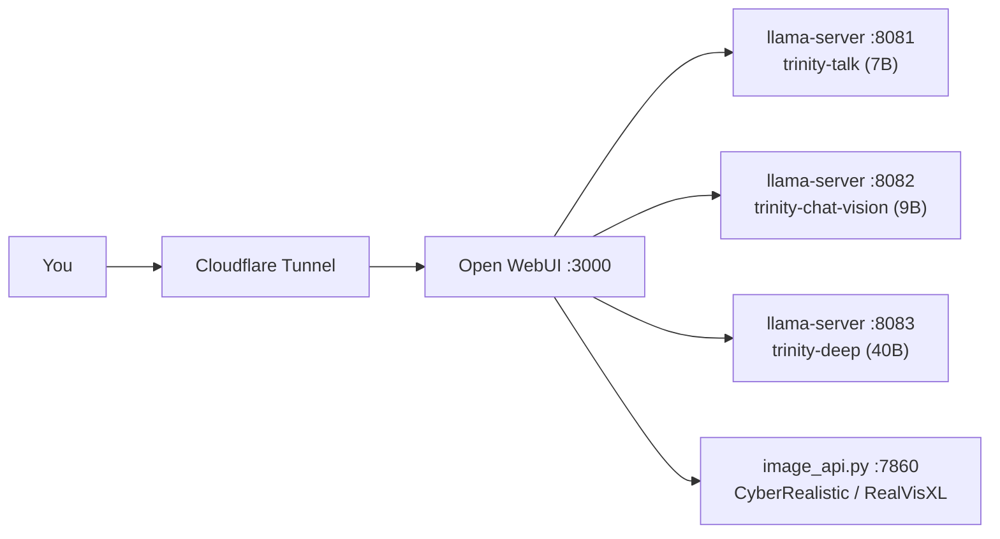

# Project Trinity

>*Note: The code in this repository is a reference architecture designed specifically for Kaggle's Dual-T4 environment. File paths are hardcoded to my private Kaggle datasets containing the GGUF and Safetensor models.*

This is Trinity. A zero-cost, self-hosted, private AI platform with virtually no restrictions.

I named it Trinity because it originally ran distributed across my PC, laptop, and phone. Right now it runs on Kaggle's dual-GPU cloud environment to take advantage of 30GB of free VRAM.

It packs a 40B, 9B, and 7B LLM for different reasoning tasks, plus two image generation models (RealVisXL V5.0 Lightning and CyberRealistic). It has web search, RAG, and voice built in.

## Quick Facts

- **Cost:** $0. Runs entirely on Kaggle's free GPU tier.
- **Hardware:** 2x NVIDIA T4 (30GB VRAM combined), Kaggle cloud
- **Models:** Qwen3.6-40B (Q4_K_M, deep reasoning), Qwen3.5-9B (vision), a 7B talk model (Llama 3.2 based), RealVisXL V5.0 Lightning + CyberRealistic V4.1 (image gen)
- **Frontend:** Open WebUI, pinned to v0.9.6
- **Backend:** `llama.cpp` (custom CUDA build), FastAPI, Uvicorn
- **Extras:** RAG (bge-m3 + bge-reranker-large), DuckDuckGo web search, STT/TTS, Cloudflare Tunnel for remote access

## How It's Wired Together

Fast Mode boots trinity-talk + trinity-chat-vision together for quick replies. Deep Mode boots trinity-deep alone for heavier reasoning. Never all three at once, the 30GB VRAM cap won't allow it.

## Why I Built This

I was annoyed with hitting rate limits on corporate models. I just thought it would be cool to have my own unrestricted AI, something like JARVIS or Jor-El's memory in the Fortress of Solitude.

When I started, I had no idea how AI models actually worked under the hood. I just knew they guessed the next token. But I started building anyway.

I originally tried to run everything locally. My laptop has 32GB of RAM and my PC has a GTX 1660 Super with 6GB of VRAM. I downloaded a 50GB safetensor file for Qwen3.6 27B and tried to abliterate (uncensor) it overnight with a tool called heretic. My 32 gigs of RAM couldn't handle the math and threw a segmentation fault at 46%.

I pivoted to downloading pre-abliterated, quantized GGUF files instead. I set up Ollama, Docker, Tailscale, and Open WebUI. It worked, but running a 27B model on my hardware took minutes just to reply with "Hi". The tokens-per-second rate was brutal. 6GB of VRAM is a joke for heavy AI tasks. I needed something like 30GB+ to run a real text model and image generation at the same time.

## The Cloud Pivot & The Hardware Hacks

I found out Kaggle notebooks offer 30GB of VRAM (two 15GB NVIDIA T4 GPUs) for free. That was enough. But Kaggle has strict cloud wardens, and I had to engineer my way around them.

**The Disk Limit**
Kaggle only gives you a 20GB working directory. My 4-bit quantized 40B model alone was 24GB. I got around this by uploading the models to a private Kaggle Dataset and mounting it as a read-only drive. Zero disk space used.

**The Linux CUDA Problem**
I switched from Ollama to `llama.cpp` for better control. But Kaggle runs on Linux, and I couldn't find a pre-compiled Linux CUDA build that worked for me. I tried a Vulkan build first, but it defaulted to system RAM instead of VRAM, making it painfully slow. I eventually hunted down a third-party CUDA build, but the shared-library symlinks were broken. I used AI to help generate Python scripts to manually delete and recreate the `.so` links so the Linux environment could actually boot the server.

**The VRAM Physics (Multi-Model Routing)**
Once CUDA was working, the 40B model was getting a solid 8 to 9 tokens per second across both GPUs. That's fine for heavy reasoning, but a bit slow for rapid, casual conversation. So I added two 5-bit quantized models on top: a 7B non-thinking model and a 9B vision model. Both respond at blistering speeds.

Because of the 30GB VRAM cap, I can't run all three at once. I used AI to implement a deployment script to split the architecture into two modes: Deep Mode boots the 40B model for heavy logic and coding, Fast Mode boots the 7B and 9B models for instant chat and vision tasks.

**The Image API & Memory Routing**
I wanted image generation natively in the chat. FLUX.1 was too heavy, so I went with CyberRealistic (SD 1.5) and RealVisXL instead. Instead of installing a heavy UI like ComfyUI, I used AI to implement a custom FastAPI server in Python that mimics the Automatic1111 API.

To stop things crashing from Out-Of-Memory errors, I used `torch.cuda.mem_get_info` to check the actual free memory on each GPU. The script dynamically routes image generation to whichever GPU has the most room left.

**The Privacy Reality Check**
I initially set up end-to-end encrypted SSH tunnels using Pinggy because Cloudflare isn't truly private. But running on rented cloud hardware means you're never completely private no matter what tunnel you use, so I mostly stopped bothering with it.

Funny thing about "privacy" though: Kaggle auto-banned my account because their automated scanners flagged some NSFW prompts I was using to test whether my models were actually uncensored. The support team manually reviewed it and gave the account back.

**The Ghost in the Machine**
When I got the account back and reran everything, nothing made sense anymore. Open WebUI kept randomly dying. trinity-talk stopped responding. Voice and image generation would disconnect the whole UI mid-request. I spent hours convinced Kaggle had quietly throttled something as a soft punishment. Turned out I'd always been pulling the latest Open WebUI on every fresh session, and they'd shipped a v0.10.x series that broke audio and image handling right around the time I got banned. My whole platform was built and tuned against v0.9.6. Pinning the version fixed everything. Not Kaggle's fault, not my code, just bad timing on a dependency update.

## The Final Architecture Flow

**Cell 1 & 2 (Environment Setup)**
Copies the precompiled `llama.cpp` folder from the read-only dataset into the writable `/kaggle/working` directory. Deletes broken shared-library links and recreates them so Linux can locate the CUDA and GGML runtime libraries.

**Cell 3 & 4 (Validation)**
Marks the server binary as executable and runs a version check with the correct `LD_LIBRARY_PATH` to make sure the GPUs are recognized.

**Cell 5A or 5B (The Switcher)**
Kills old processes. Boots either Fast Mode (7B + 9B on ports 8081/8082) or Deep Mode (40B on port 8083). Configures context size and forces full GPU offloading.

**Cell 6 & 7 (Health Polling)**
Polls the `/health` endpoints until the models are loaded into VRAM, then reports which inference servers are online.

**Cell 8 & 9 (The Frontend)**
Installs dependencies and boots Open WebUI, pinned to v0.9.6, the version this whole build was tuned against. Configures environment variables to connect the local llama.cpp servers, DuckDuckGo web search, and bge-m3 RAG embeddings.

**Cell 10 (The Network Bridge)**
Starts a Cloudflare Tunnel exposing the local port 3000 to the public internet so I can reach the UI from my phone or laptop.

**Cell 11 or 12 (The Image Engine)**
Boots the custom FastAPI server. Loads either CyberRealistic or RealVisXL. Automatically chooses full GPU loading or CPU offloading depending on available VRAM, and exposes an API on port 7860.

## What I Learned

I started this just wanting a chatbot. I ended up getting a crash course in system architecture.

Things like parameters, weights, quantization, and abliteration were just buzzwords to me a few weeks ago. Building this actually taught me what they are and how they physically interact with silicon. I learned how hardware constraints dictate software design, how PyTorch actually manages memory, and how to debug undocumented API handshakes.

It was a masterclass in reading error logs and realizing that in systems engineering, the problem is rarely the AI model itself. It's almost always the plumbing connecting it.

## What's Next

If I ever move this off rented hardware onto something I actually own, it becomes properly private instead of "as private as a cloud GPU lets you get." That's the plan eventually.

I wrote most of the Python for this with AI assistance, and leaned on it heavily for debugging too. No point pretending otherwise.
